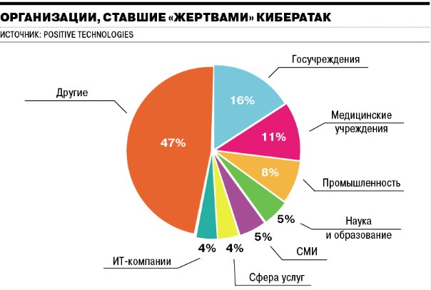
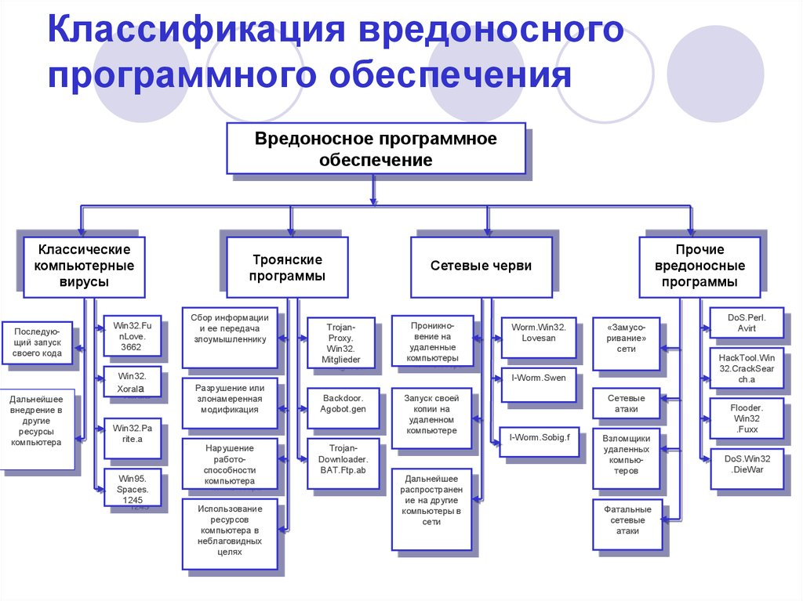
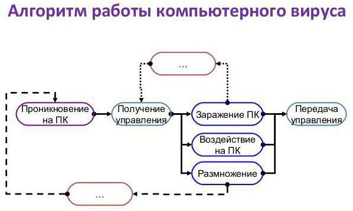
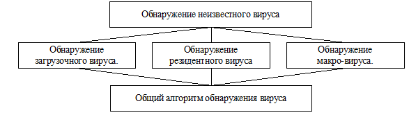
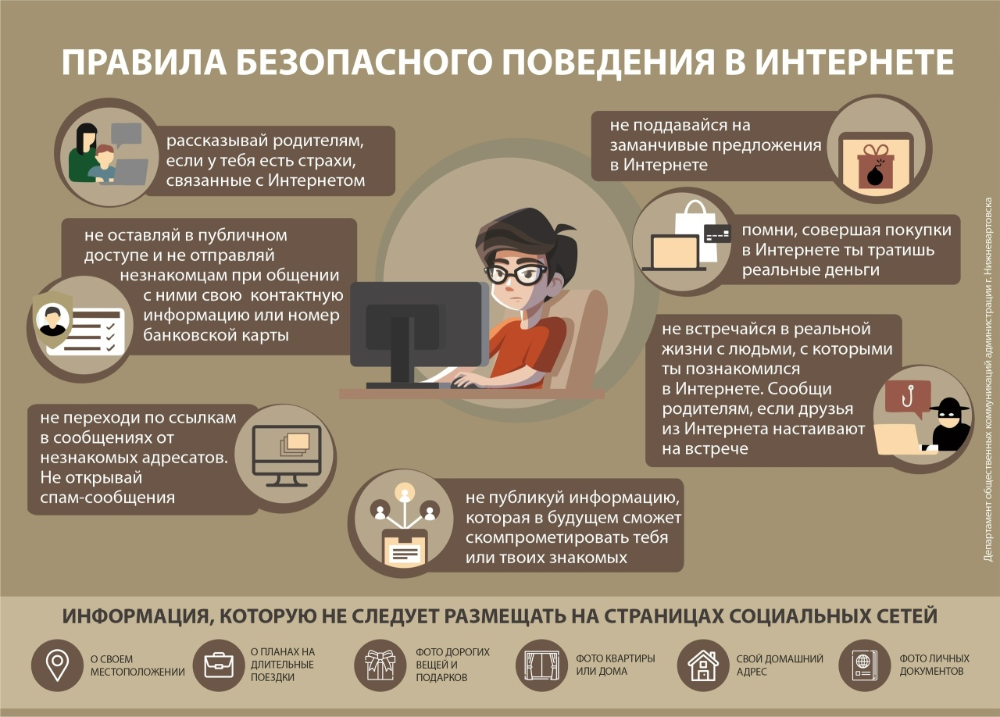

---
## Author
author:
  name: Баранов Георгий Павлович
  email: 1132246760@rudn.ru
  affiliation:
    - name: Российский университет дружбы народов
      country: Российская Федерация
      postal-code: 117198
      city: Москва
      address: ул. Миклухо-Маклая, д. 6
## Title
title: 'Вредоносные программы: Вирусы и антивирусы'
license: CC BY
date: today
date-format: "YYYY-MM-DD" # Example: 2025-09-06
---

# Информация

## Докладчик

Баранов Георгий  
НКАбд-01-24  
Российский университет дружбы народов

## Научный руководитель

Кулябов Дмитрий Сергеевич  
д.ф.-м.н., профессор  
Российский университет дружбы народов

# Введение

## Актуальность

{width=80%}

Кибератаки растут с каждым годом

## Объект и предмет

**Объект:** Информационная безопасность  
**Предмет:** Вредоносные программы и антивирусы

## Цель работы

Проанализировать виды вредоносных программ  
и методы защиты от них

# Классификация

## Типы вредоносных программ

{width=90%}

## Как работает вирус

{width=80%}

Внедрение в код других программ

## Сетевые черви

Распространяются самостоятельно по сети  
Не требуют действий пользователя

## Трояны

Маскируются под полезные программы  
Не размножаются, но воруют данные

## Ransomware

Шифруют файлы и требуют выкуп  
Одна из главных угроз 2024 года

# Защита

## Методы обнаружения

{width=90%}

## Принцип работы антивируса

1. Сигнатурный анализ — поиск по базе
2. Эвристический — анализ поведения
3. Поведенческий — мониторинг в реальном времени
4. Облачный — проверка на сервере

# Правила безопасности

## Цифровая гигиена

{width=85%}

## Главные правила

- Обновляй ПО
- Не открывай подозрительные ссылки
- Используй сложные пароли
- Делай бэкапы

# Заключение

## Выводы

- Вирусы эволюционируют
- Антивирусы становятся умнее
- Но главный фактор — сам пользователь

## Спасибо за внимание!

Вопросы?

