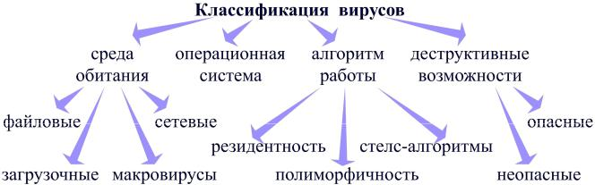

---
## Author
author:
  name: Баранов Георгий Павлович
  email: 1132246760@rudn.ru
  affiliation:
    - name: Российский университет дружбы народов
      country: Российская Федерация
      postal-code: 117198
      city: Москва
      address: ул. Миклухо-Маклая, д. 6

## Title
title: 'Вредоносные программы: Вирусы и антивирусы'
subtitle: Реферат по направлению «Компьютерные и информационные науки»
license: "CC BY"
---

# Введение

Мы живём в мире, где интернет и компьютерные технологии стали не просто удобным инструментом, а необходимостью. Мы храним там фотографии, рабочие документы, переписываемся с друзьями и даже управляем своими финансами. Но, как и в реальном мире, в цифровом тоже есть свои опасности. И одна из главных — вредоносные программы.

Каждый день мы слышим новости о том, что крупные компании или государственные учреждения подверглись хакерской атаке, у пользователей украли пароли или заблокировали компьютеры с требованием выкупа. К сожалению, с этим может столкнуться каждый. Поэтому тема этого реферата сейчас актуальна как никогда: важно понимать, с чем мы имеем дело и как от этого защищаться.

В своей работе я постарался разобраться в том, какие вообще бывают вредоносные программы, чем они отличаются друг от друга, как они эволюционировали и, самое главное, как современные антивирусы пытаются с ними бороться. Ведь антивирус есть почти у всех на компьютере, но мало кто задумывается, как именно он работает и даёт ли он стопроцентную гарантию безопасности.

**Научный руководитель:** Кулябов Дмитрий Сергеевич, д.ф.-м.н., профессор кафедры теории вероятностей и кибербезопасности РУДН.

# Классификация вредоносных программ

Начнём с основ. Вредоносная программа (или malware) — это любой код, который создан для того, чтобы навредить пользователю или его компьютеру: украсть данные, сломать систему, заработать на вас деньги. За многие годы этих «вредителей» развелось так много, что их пришлось разделить на группы по способу действия. Основные типы показаны на рисунке 1.

{#fig:malware-types width=70%}

## Компьютерные вирусы

Это, пожалуй, самый старый и известный тип. Вирус — это программа, которая умеет размножаться, внедряя свой код в другие файлы. Главное его отличие в том, что для активации обычно нужно действие человека: запустить заражённую игру, открыть «странный» документ Word или установить программу с сомнительного сайта. Вирусы живут не только в файлах, но и, например, в загрузочных секторах диска.

По среде обитания вирусы можно разделить на:
- **Файловые вирусы** — внедряются в исполняемые файлы (.exe, .com);
- **Загрузочные вирусы** — поражают загрузочный сектор диска;
- **Макровирусы** — живут в документах Office (Word, Excel);
- **Скриптовые вирусы** — распространяются через скрипты на веб-страницах.

## Сетевые черви

Черви — это «самостоятельные» вредители. Им не нужна программа-носитель. Они распространяются по сети самостоятельно, используя дыры в безопасности или просто рассылая себя по электронной почте. Один из самых известных примеров — червь Morris 1988 года, который парализовал работу значительной части раннего интернета. Главная цель червя — максимально быстрое распространение, а уже потом — деструктивные действия.

## Троянские программы

Трояны работают по принципу «троянского коня». Они маскируются под что-то полезное: кряк для игры, новый кодек для фильма, симпатичную картинку. Пользователь сам скачивает и запускает «подарок», а получает дыру в безопасности или украденные пароли. Сами они не размножаются, их задача — замаскироваться и открыть доступ злоумышленнику. Чаще всего трояны используют для кражи данных или создания «чёрного входа» в систему.

## Другие виды вредоносных программ

- **Руткиты** — это «невидимки». Они прячутся в системе так, что их не видно ни в диспетчере задач, ни в списке программ. Обычно они маскируют присутствие других вирусов и позволяют злоумышленнику долгое время оставаться незамеченным.
- **Шпионское ПО (Spyware)** — следит за пользователем: какие сайты посещает, что печатает на клавиатуре (кейлоггеры), какие пароли вводит. Вся эта информация уходит злоумышленнику.
- **Рекламное ПО (Adware)** — включает рекламу, которую вы не просили, открывает сайты с рекламой, вставляет баннеры. Чаще раздражает, чем реально вредит, но тоже снижает безопасность и производительность системы.
- **Программы-вымогатели (Ransomware)** — это бич последних лет. Они шифруют все документы на компьютере (фото, курсовые, базы данных), а потом требуют деньги за расшифровку [@kaspersky_ransomware]. Защититься от них сложнее всего, потому что они действуют быстро и часто используют надёжные алгоритмы шифрования.

# История развития и методы распространения

Вредоносные программы прошли большой путь. Сначала, в 80-х годах, это были скорее студенческие шалости, которые передавались через дискеты. Первый вирус для персональных компьютеров назывался «Brain» и появился в 1986 году. Его создали два пакистанских программиста, которые хотели защитить свои медицинские программы от пиратского копирования, но эффект получился обратным.

С появлением интернета всё изменилось. В 90-е и 2000-е начались настоящие эпидемии. Вирусы типа «ILOVEYOU» или «Melissa» за несколько часов заражали миллионы компьютеров по всему миру, просто потому что люди открывали вложения в письмах с заманчивыми названиями. Ущерб от таких эпидемий исчислялся миллиардами долларов.

Потом пришла эра денег. Трояны начали воровать доступы к интернет-банкам, а заражённые компьютеры объединяли в ботнеты, чтобы атаковать сайты или рассылать спам. Ботнет — это сеть из тысяч или даже миллионов заражённых машин, которыми злоумышленник управляет удалённо.

Сейчас мы видим и целенаправленные атаки на заводы и электростанции. Самый известный пример — вирус Stuxnet, который поразил ядерные центрифуги в Иране. Это уже не просто хулиганство, а кибероружие государственного уровня.

Как же вирусы попадают к нам сегодня? Основные векторы распространения:

- **Почта (фишинг)** — вам приходит письмо, вроде бы от банка, от госорганов или от «друга», с просьбой открыть вложение или перейти по ссылке. Ссылка ведёт на поддельный сайт, где просят ввести пароль, или сразу начинается загрузка вируса.
- **Веб-сайты** — заходишь на обычный, легальный сайт, а он оказывается взломан, и в фоновом режиме на компьютер что-то скачивается (так называемая drive-by download атака).
- **Съёмные носители** — флешки и внешние диски до сих пор остаются опасными, особенно в офисах и учебных заведениях, где люди постоянно обмениваются файлами.
- **Пиратский софт** — скачал «бесплатно» Photoshop или новую игру, а вместе с ними получил майнер криптовалюты или троян. Майнер будет использовать мощности компьютера для добычи криптовалюты, что приведёт к тормозам и перегреву.

# Антивирусные программы: принципы работы и классификация

Антивирусы — это наша главная линия обороны. Современный антивирус — это не просто программа, а целый комплекс, который следит за всем, что происходит в системе. Он проверяет файлы, следит за подозрительным поведением программ, контролирует сетевой трафик.

## Методы обнаружения угроз

Как же антивирус понимает, что файл опасен? Способов несколько, и в хорошем антивирусе используются все сразу. Сравнение основных методов приведено в таблице 1.

: Сравнение методов обнаружения вредоносных программ

| Метод | Суть метода | Плюсы | Минусы |
| :--- | :--- | :--- | :--- |
| **Сигнатурный анализ** | Сравнение файла со словарём известных вирусов | Очень точный, почти не ошибается | Бесполезен против новых вирусов, которых нет в словаре |
| **Эвристический анализ** | Анализ подозрительного поведения. Похоже на вирус? Блокируем | Может найти новую, неизвестную угрозу | Иногда ошибается и ругается на безобидные программы |
| **Поведенческий анализ** | Слежка за программами в реальном времени. Если программа начала шифровать файлы — стоп! | Лучший способ поймать программу-вымогатель | Срабатывает, когда заражение уже началось |
| **Облачные технологии** | Часть анализа происходит на серверах компании-разработчика | Мгновенная реакция на новые угрозы, низкая нагрузка на компьютер | Нужен постоянный интернет |

Сигнатурный анализ — самый старый и надёжный метод. Антивирус хранит базу данных с уникальными фрагментами кода известных вирусов (сигнатурами) и сравнивает с ними все файлы. Если нашёл совпадение — вирус обнаружен. Проблема в том, что новые вирусы появляются каждый день, и пока сигнатура не попадёт в базу, антивирус их не видит.

Эвристический анализ пытается угадать вирус по поведению. Например, если программа пытается открыть системный файл для записи или изменить чужой код — это подозрительно. Эвристика помогает ловить новые вирусы, но иногда выдаёт ложные срабатывания.

Поведенческий анализ работает ещё хитрее. Он не смотрит на код, а следит за действиями программы. Если программа вдруг начала массово шифровать документы — скорее всего, это ransomware, и антивирус немедленно блокирует процесс.

Облачные технологии позволяют антивирусу отправлять подозрительные файлы на сервер разработчика для углублённого анализа. Там работают суперкомпьютеры и эксперты, которые быстро определяют, опасен файл или нет. Плюс такого подхода — все пользователи антивируса получают защиту от новой угрозы одновременно, как только её обнаружат на одном компьютере.

## Классификация антивирусов

По способу развёртывания и режиму работы антивирусы делятся на:

- **Сканеры** — мы запускаем проверку вручную. Сканер проверяет жёсткий диск, находит заражённые файлы и лечит или удаляет их. Минус в том, что между проверками вирус может успеть наделать дел.
- **Мониторы** — висят в памяти постоянно и проверяют всё «на лету». Как только вы открываете файл, запускаете программу или сохраняете документ, монитор его проверяет. Это гораздо надёжнее, чем периодические проверки.
- **Файрволы (брандмауэры)** — следят за сетевым трафиком. Они контролируют, какие программы выходят в интернет и какие подключения приходят извне. Если неизвестная программа пытается отправить данные на подозрительный сервер, файрвол блокирует соединение.
- **Комплексные решения (Internet Security)** — сборная солянка: антивирус + файрвол + защита от спама + родительский контроль + безопасные платежи. Такие пакеты обеспечивают максимальную защиту, но и стоят дороже, и требуют больше ресурсов.

## Проблемы и ограничения антивирусов

Но, как ни крути, антивирус — это не панацея, и у него есть серьёзные ограничения.

**Во-первых, реактивность.** Антивирус всегда немного «отстаёт» от реальности. Пока новый вирус попадёт в лабораторию, пока его проанализируют, пока создадут сигнатуру и разошлют обновления — кто-то уже успеет пострадать. Этот разрыв во времени называют window of vulnerability.

**Во-вторых, целевые атаки.** Бывают ситуации, когда вирус пишут специально под одного человека, одну компанию или даже одну программу. Такой вирус антивирус просто не знает, потому что его сигнатуры нет в базе, и поведение может быть не похоже на типичное вредоносное. Это называется APT-атаки (Advanced Persistent Threat).

**В-третьих, производительность.** Антивирусы потребляют ресурсы: процессор, память, дисковые операции. На современных мощных компьютерах это незаметно, но на старых или слабых машинах антивирус может вызывать заметные тормоза, особенно во время проверок.

**В-четвёртых, ложные срабатывания.** Иногда антивирус ошибочно принимает безобидную программу за вредоносную и блокирует её. Это может привести к проблемам в работе, потере данных или просто к нервотрёпке.

# Заключение

Подводя итог, можно сказать, что мир вредоносных программ за несколько десятилетий превратился из студенческих хобби в мощную индустрию зла. Вирусы, черви, трояны и вымогатели становятся всё умнее и опаснее. Методы атак постоянно совершенствуются, а цели смещаются от простого хулиганства к финансовой выгоде и даже кибервойнам.

Антивирусы, в свою очередь, тоже не стоят на месте. Из простых «сравнивателей» с сигнатурной базой они превратились в сложные комплексы с эвристическим и поведенческим анализом, облачными технологиями и искусственным интеллектом. Современный антивирус — это многоуровневая система защиты, которая контролирует не только файлы, но и сетевые соединения, поведение программ и даже действия пользователя.

Однако, как показало это исследование, полностью полагаться только на антивирус нельзя. Слишком многое зависит от самого человека. Самый современный антивирус бесполезен, если пользователь сам скачает и запустит вирус, проигнорировав все предупреждения, или если он использует простой пароль, который легко подобрать.

Поэтому безопасность — это всегда комбинация технологий и нашей с вами осторожности. Регулярно обновлять программы, не переходить по подозрительным ссылкам, использовать сложные пароли, не скачивать пиратский софт, делать резервные копии важных файлов — эти простые правила, возможно, защитят лучше любого платного антивируса. Информационная безопасность начинается с нас самих.

# Список литературы

1. Лаборатория Касперского. Что такое вредоносное программное обеспечение [Электронный ресурс]. — Режим доступа: https://www.kaspersky.ru/resource-center/threats/malware (дата обращения: 20.02.2026).

2. Positive Technologies. Актуальные киберугрозы: тренды 2024 года [Электронный ресурс]. — Режим доступа: https://www.ptsecurity.com/ru-ru/research/ (дата обращения: 20.02.2026).

3. Microsoft. Защита от вредоносных программ в Windows [Электронный ресурс]. — Режим доступа: https://learn.microsoft.com/ru-ru/windows/security/ (дата обращения: 20.02.2026).
